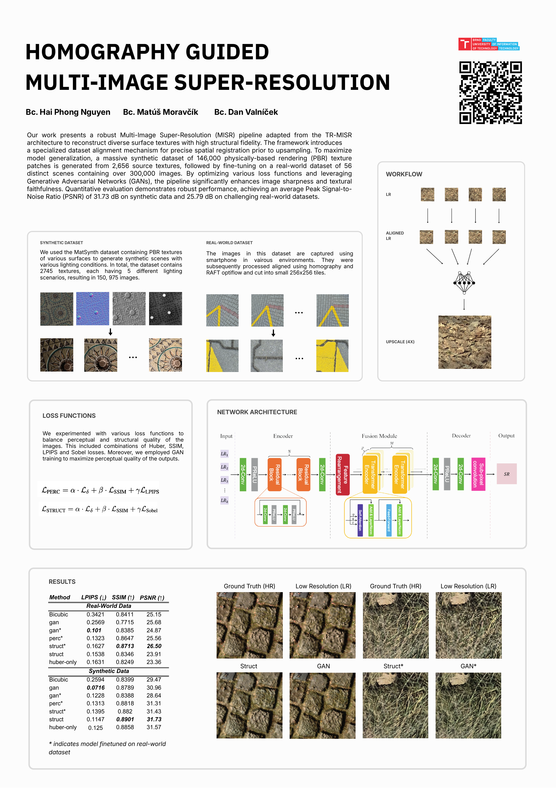
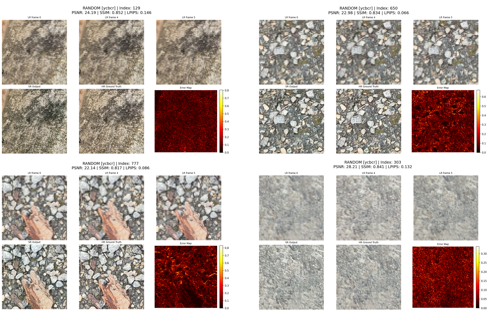

# Multi Image Super Resolution



Qualitative results on synthetic samples. Top: subset of LR input frames. Bottom: comparison between SR output, HR ground truth, and the pixel-wise
Error Map. Brighter regions in the error map indicate discrepancies, typically found near high-frequency edges.




## Set up 
```bash
python3.12 -m venv env
source env/bin/activate

pip install -r requirements.txt
pip install -e .
```

